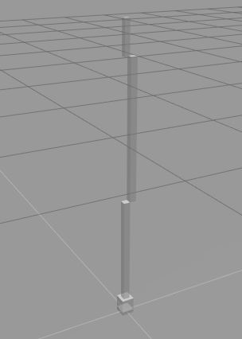
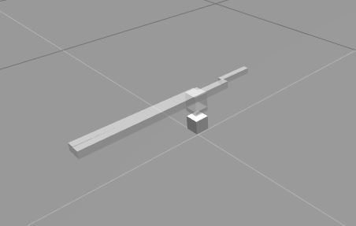
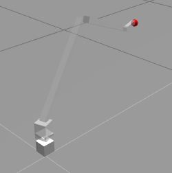
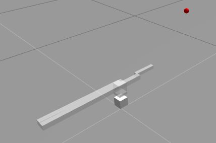
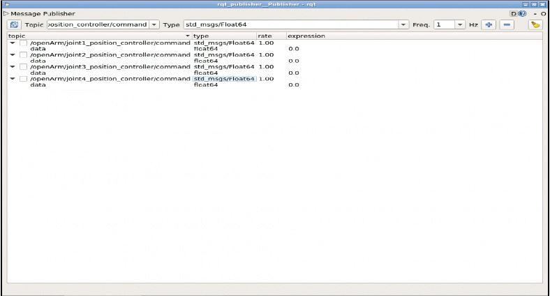
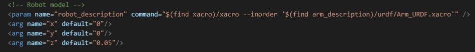

# :mechanical_arm: arm_description :mechanical_arm:
arm_description uses Ros Kinetic and Gazebo

  The arm_description package contains the URDF geometry, inverse kinematics and controller for the virutal openArm. The inertial properties match those of the real openArm, though friction at the joints has yet to be implemented. The base of the openArm is locked in space depending on parameters specified in the launch file used.

## Launching

There are two ways to spawn the virtual openArm. The first simply spawns the openArm and starts its joint controllers along with an rqt publisher which can be used to manipulate the arm in Gazebo. This is launched with the following command:

roslaunch arm_description arm_spawn.launch

The second method of launching requires the package dcam_description, the openArm depth camera, to be cloned into the same src directory, as well as all its dependencies. This following command launches the openArm and the depth camera, as well as the arm_control_node:

roslaunch arm_description all_spawn.launch

Do not be alarmed at the scrolling error messages. This may be because the depth camera has not recognized any button in front of it. The error messages should no longer refresh once the button is spotted.

Please see the appendix at the bottom for a list of topics and nodes which are started from either launch.

## Use

When the all_spawn.launch command is entered, the arm_control_node starts. This node is looking for a string type command: either "press" or "rest" in the arm_action topic.
A press is initiated with this command:

rostopic pub /arm_action std_msgs/String press

To return to resting position, use this command:

rostopic pub /arm_action std_msgs/String rest

Make sure the button is within the field of view of the depth camera. A quick way to visually debug this is by using the following command:

rosrun image_view image_view image:=/depth_camera_ir/depth_camera/color/image_raw

This outputs a first-person color view from the depth camera.

## Modifying Virtual openArm

### Geometry

It is not recommended that the geometry is modified in any way. This is because the code for openArm is not parameterized, so multiple measurements must be changed if the openArm geometry is changed. To change openArm geometry, simply access the Arm_URDF.xacro file in the URDF folder. 

Each joint matches its location and "effort", or maximum giveable torque in Nm, to that on the openArm. The collision parameters are also set to match the shape of the geometry. To modify anything, I would recommend watching the construct's video series on the "My Robot Manipulator" project, linked here: https://www.youtube.com/playlist?list=PLK0b4e05LnzYpDnNeWJcQLju7JfJFX-lk.

### Controllers

The virtual openArm uses a PD controller (really a PID controller with zero ki) for joint position. The controller gains can be found in the joints.yaml file in the config folder. Using the rqt publisher launched with arm_spawn.launch, different positions can be entered as targets for virtual openArm. 

This can be used to test the affect of controller gains on joint behavior, for example to check for oscillation. Enter float values for target positions under the "expression" column. Check the box next to the topic name to begin publishing the coordinate to that topic.

### Launch Files

The launch files can be modified to change the position of the openArm in the Gazebo simulation. See the snip from the all_spawn.launch file below:

In this case, the virtual openArm will spawn 5 cm from the ground. This makes way for the depth camera which spawns below it. This same structure is present in the arm_spawn.launch file.

## Appendix
### arm_spawn.launch Topics

/clock
/gazebo/link_states
/gazebo/model_states
/gazebo/parameter_descriptions
/gazebo/parameter_updates
/gazebo/set_link_state
/gazebo/set_model_state
/openArm/joint1_position_controller/command
/openArm/joint1_position_controller/pid/parameter_descriptions
/openArm/joint1_position_controller/pid/parameter_updates
/openArm/joint1_position_controller/state
/openArm/joint2_position_controller/command
/openArm/joint2_position_controller/pid/parameter_descriptions
/openArm/joint2_position_controller/pid/parameter_updates
/openArm/joint2_position_controller/state
/openArm/joint3_position_controller/command
/openArm/joint3_position_controller/pid/parameter_descriptions
/openArm/joint3_position_controller/pid/parameter_updates
/openArm/joint3_position_controller/state
/openArm/joint4_position_controller/command
/openArm/joint4_position_controller/pid/parameter_descriptions
/openArm/joint4_position_controller/pid/parameter_updates
/openArm/joint4_position_controller/state
/openArm/joint_states
/rosout
/rosout_agg

### arm_spawn.launch Nodes

/openArm/controller_spawner
/openArm/rqt_publisher
/openArm/rqt_reconfigure

### all_spawn.launch Topics

/arm_action
/button_xyz
/clock
/depth_camera_ir/depth/camera_info
/depth_camera_ir/depth_camera/color/camera_info
/depth_camera_ir/depth_camera/color/image_raw
/depth_camera_ir/depth_camera/color/image_raw/compressed
/depth_camera_ir/depth_camera/color/image_raw/compressed/parameter_descriptions
/depth_camera_ir/depth_camera/color/image_raw/compressed/parameter_updates
/depth_camera_ir/depth_camera/color/image_raw/compressedDepth
/depth_camera_ir/depth_camera/color/image_raw/compressedDepth/parameter_descriptions
/depth_camera_ir/depth_camera/color/image_raw/compressedDepth/parameter_updates
/depth_camera_ir/depth_camera/color/image_raw/theora
/depth_camera_ir/depth_camera/color/image_raw/theora/parameter_descriptions
/depth_camera_ir/depth_camera/color/image_raw/theora/parameter_updates
/depth_camera_ir/depth_camera/depth/image_raw
/depth_camera_ir/depth_camera/depth/points
/depth_camera_ir/parameter_descriptions
/depth_camera_ir/parameter_updates
/gazebo/link_states
/gazebo/model_states
/gazebo/parameter_descriptions
/gazebo/parameter_updates
/gazebo/set_link_state
/gazebo/set_model_state
/openArm/joint1_position_controller/command
/openArm/joint1_position_controller/pid/parameter_descriptions
/openArm/joint1_position_controller/pid/parameter_updates
/openArm/joint1_position_controller/state
/openArm/joint2_position_controller/command
/openArm/joint2_position_controller/pid/parameter_descriptions
/openArm/joint2_position_controller/pid/parameter_updates
/openArm/joint2_position_controller/state
/openArm/joint3_position_controller/command
/openArm/joint3_position_controller/pid/parameter_descriptions
/openArm/joint3_position_controller/pid/parameter_updates
/openArm/joint3_position_controller/state
/openArm/joint4_position_controller/command
/openArm/joint4_position_controller/pid/parameter_descriptions
/openArm/joint4_position_controller/pid/parameter_updates
/openArm/joint4_position_controller/state
/openArm/joint_states
/rosout
/rosout_agg
/yz_pix

### all_spawn.launch Nodes

/arm_control_node
/depth_finder
/image_converter
/openArm/controller_spawner
